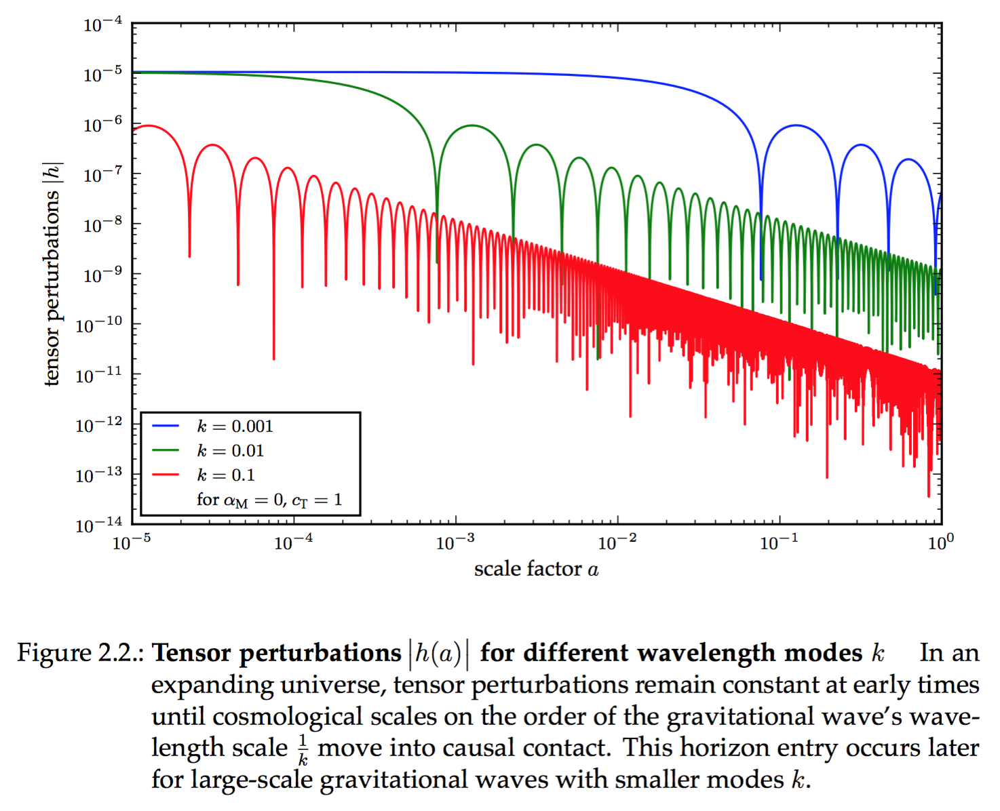

# TexFig

Python's [Matplotlib](http://matplotlib.org) can save plots as [PGF vector files](https://en.wikipedia.org/wiki/PGF/TikZ), with text containing LaTeX code and all. LaTeX can render PGF files. Sounds like a perfect match, doesn't it? (It does. See [my bachelor thesis](https://github.com/knly/bsc-thesis/blob/master/dist/bsc_digital.pdf) for examples.)




## Why PGF?

- It's a vector format. No blurry pixel graphics anymore!
- Any text in your plots will be typeset with your document's native font and style.
- You can use your custom LaTeX `\newcommand` macros in your plots after defining a dummy implementation for them in Python. They will be typeset correctly in your document.


## Usage

1. Use `texfig` to generate PGF plots:

	```python
	# import texfig first to configure Matplotlib's backend
	import texfig  # assuming texfig.py and an __init__.py is in the directory
	# then, import PyPlot
	import matplotlib.pyplot as plt

	# obtain a nicely configured figure from texfig (or make your own)
	fig = texfig.figure()
	# plot as usual
	plt.plot(range(10))
	# save your plot as both a PDF and a PGF file with texfig (or save a '.pfg' file on your own)
	texfig.savefig("example_plot")
	```
	
	You can adjust the settings in `texfig.py` to your liking.

2. Now `\usepackage{pgf}` and `\input` the PGF file in your LaTeX document:

	```tex
	% in the preamble
	\usepackage{pgf}
	% somewhere in your document
	\input{example_plot.pgf}
	```

3. Admire the beauty of LaTeX vector plots.
